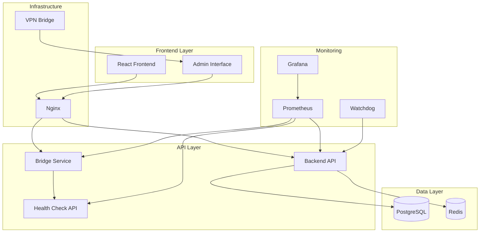

# Introduction

Welcome to **ProjectHosting** - a comprehensive project hosting platform designed for modern development teams and organizations.

## What is ProjectHosting?

ProjectHosting is a full-featured platform that provides:

- **Project Management**: Organize and showcase your projects with real-time status monitoring
- **Admin Panel**: Complete administrative interface with logging, metrics, and system management
- **Monitoring & Observability**: Built-in Prometheus metrics, Grafana dashboards, and comprehensive logging
- **Secure VPN Access**: Tailscale integration for secure remote access to admin features
- **Container Orchestration**: Docker Compose for local development, Kubernetes/Helm for production
- **Image Management**: Upload, organize, and serve images with CDN-style delivery
- **Zero-Maintenance UX**: Configure everything through the web interface without touching code

## Key Features

### 🏗️ **Modern Architecture**
- Microservices architecture with Docker containers
- React frontend with responsive design
- Flask backend with RESTful APIs
- PostgreSQL database with Redis caching
- Nginx reverse proxy with SSL termination

### 📊 **Comprehensive Monitoring**
- Prometheus metrics collection
- Grafana dashboards for visualization
- Centralized logging with search and filtering
- Health checks for all services
- Real-time system status monitoring

### 🔒 **Enterprise Security**
- JWT-based authentication
- Role-based access control
- VPN-only admin access via Tailscale
- Rate limiting and CORS protection
- Security scanning and vulnerability management

### ☸️ **Cloud-Native Deployment**
- Kubernetes-ready with Helm charts
- Horizontal auto-scaling
- Rolling updates with zero downtime
- Multi-environment support (dev/staging/prod)
- Infrastructure as Code with Terraform

### 🎨 **User-Friendly Interface**
- Responsive web design for all devices
- Dark/light theme support
- Intuitive admin dashboard
- Real-time updates and notifications
- Accessibility compliance (WCAG 2.1)

## Quick Start

Get ProjectHosting running in minutes:

```bash
# Clone the repository
git clone https://github.com/Axle-Bucamp/projectHosting.git
cd projectHosting

# Start with Docker Compose
docker-compose up -d

# Access the application
open http://localhost:3000
```

For detailed setup instructions, see our [Getting Started Guide](./user-guide/getting-started.md).

## Architecture Overview



## Use Cases

### Development Teams
- Host and showcase project portfolios
- Monitor application health and performance
- Collaborate securely with VPN access
- Automate deployments with CI/CD

### Agencies & Consultants
- Present client projects professionally
- Provide secure client access to admin features
- Monitor multiple projects from one dashboard
- Scale infrastructure based on client needs

### Educational Institutions
- Showcase student projects
- Provide learning environments
- Monitor resource usage
- Secure access for administrators

### Startups & SMBs
- Professional project presentation
- Cost-effective hosting solution
- Built-in monitoring and alerting
- Easy scaling as you grow

## Community & Support

- **Documentation**: Comprehensive guides and API reference
- **GitHub**: Source code, issues, and discussions
- **Community**: Join our Discord for real-time help
- **Professional Support**: Enterprise support available

## License

ProjectHosting is open-source software licensed under the [MIT License](https://github.com/Axle-Bucamp/projectHosting/blob/main/LICENSE).

---

Ready to get started? Check out our [Installation Guide](./deployment/docker.md) or explore the [API Documentation](./api/overview.md).

